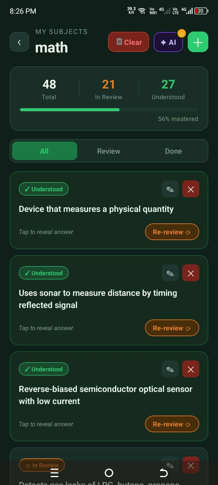
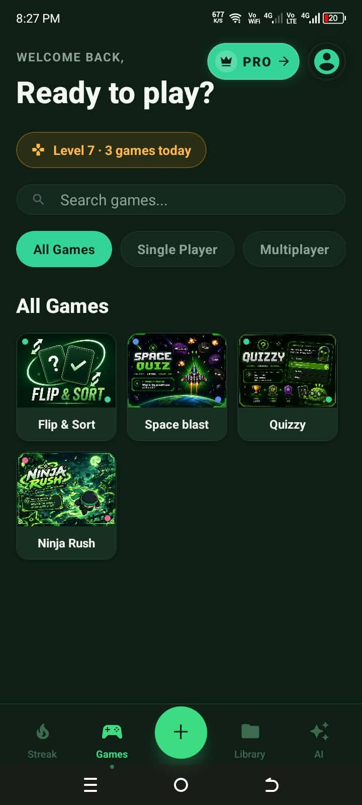
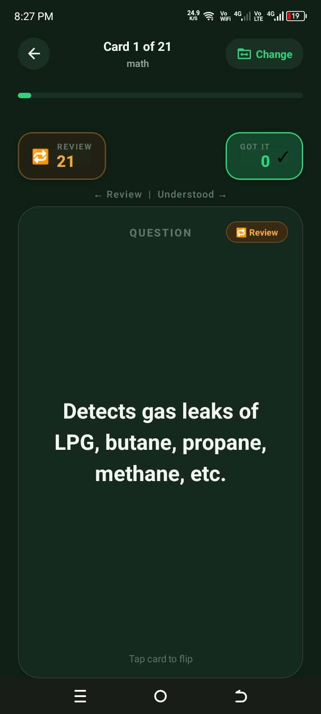
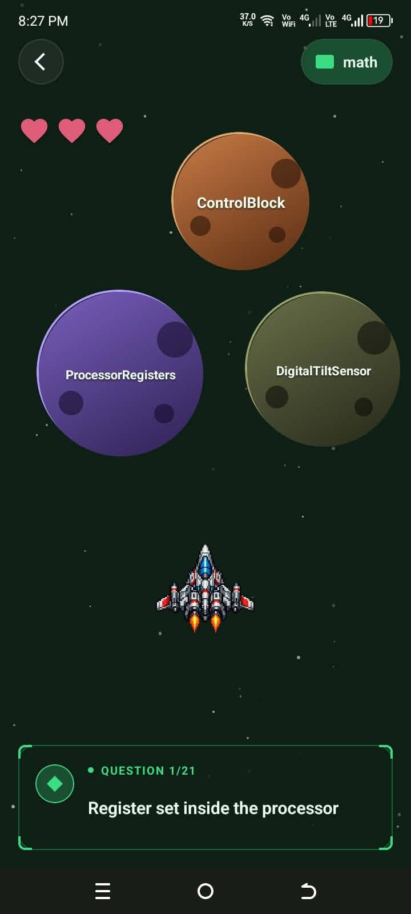
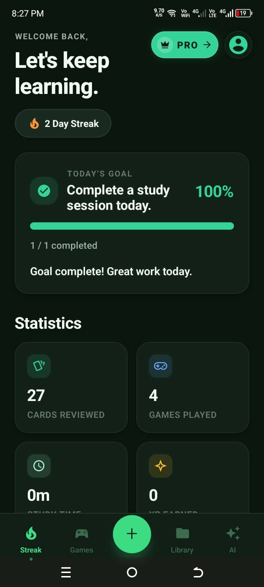

# Spacia

  

  <strong>An AI-powered study app that makes learning interactive, personalized, and rewarding.</strong>

---

## ✨ Features

### 🤖 AI Study Assistant

Get personalized assistance, explanations, and guidance while studying.

  

---

### 🃏 Flashcards

Create and review custom flashcards to reinforce learning and improve retention.

  

---

### 🎮 Gamified Learning

Turn studying into an engaging experience with interactive mini-games and challenges.

<table align="center">
  <tr>
    <td align="center">
      
    </td>
    <td align="center">
      
    </td>
    <td align="center">
      
    </td>
    <td align="center">
      
    </td>
  </tr>
</table>

---

### 🔥 Study Streaks

Maintain daily study streaks and build consistent learning habits.

  

---

## 🚀 Built to Make Studying More Engaging

Spacia combines **AI assistance, flashcards, gamification, streaks, and rewards** into one study experience designed to make learning more interactive and enjoyable.

Application Link here : 
https://expo.dev/accounts/marcelhahaha/projects/spacia/builds/4fc21681-9d2d-4cab-952a-21ff4fbc2625?fbclid=IwY2xjawUjQKVleHRuA2FlbQIxMABwZG9mBWJyaWQRMWlzRnpKOEVjalZNRkQ2RklzcnRjBmFwcF9pZBAyMjIwMzkxNzg4MjAwODkyAAEelHb4pogzuvEXTA3gxX3xGz7PWobYnWuhMYpLo8S3KJ10lg5N6ZKj_DE3vYw_aem_IO0t4IeDrrKAOI6e4CeRdw
