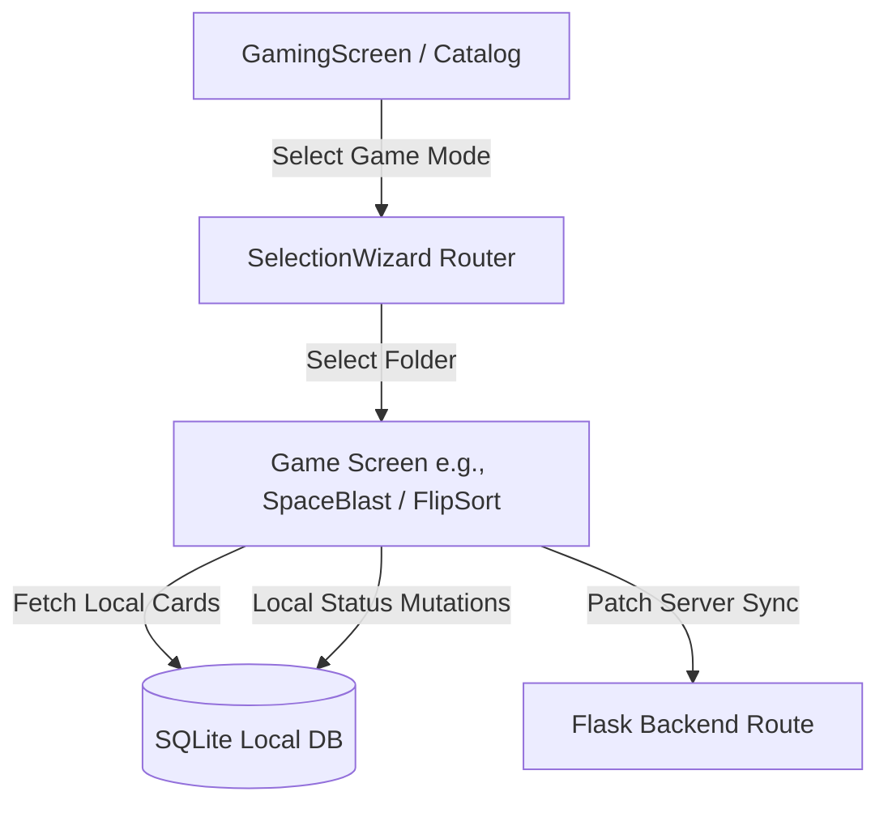

# Games Module (`/client/src/features/games`)

## 1. Purpose

The Games module manages gamified learning experiences in Spacia. It translates static flashcard study sets into interactive, high-engagement game modes (like a 3D Card Flipper or an Asteroid Bullet Shooter) to reinforce memory retention and recall.

This module houses both the game selection landing interface (`GameCatalog`), individual game implementations, and the shared configurations that connect study sets to interactive states.

---

## 2. Folder Structure

```text
client/src/features/games/
├── FlipSort/                # Flip & Sort: 3D study card swipe game
├── GameCatalog/             # Catalog interface displaying active game modes
├── MemoryMatch/             # Memory Match game mode (Placeholder)
├── SpaceBlast/              # Space Blast: Asteroid-shooting response game
├── WordRush/                # Word Rush game mode (Placeholder)
├── screens/                 # Shell wrapper screen definitions
│   └── GamingScreen.tsx     # Combines SafeArea and router hooks to load catalog
└── README.md
```

---

## 3. Overall Architecture

The games engine is built around a decoupled architecture where games function as self-contained feature screens that consume card arrays from standard database repositories:



### Shared Logic & Services
Rather than implementing folder lists and DB loaders inside each game, the system uses shared repositories and routing wizards to standardize parameters.

### Shared Components
* **Selection Wizard (`SelectionWizard.tsx`)**: Located in `@/shared/components/games/`. A unified folder selection screen that displays subjects and their card counts. It acts as an gatekeeper before starting any game mode.

### Shared Hooks
* **useSelectionWizard (`useSelectionWizard.ts`)**: Retrieves folders list from SQLite, fetches online updates, and counts cards to populate the selection interface.

---

## 4. Navigation & Data Flow

### 1. Navigation Flow
1. User enters the Game tab (`/(tabs)/game`), loading `GamingScreen` and rendering the `GameCatalog` listing available modes.
2. User taps a game mode (e.g., Space Blast). The catalog forwards the user to `/games/SelectionWizard` passing the game route as a parameter:
   ```typescript
   router.push({ pathname: '/games/SelectionWizard', params: { gameRoute: '/games/SpaceBlast' } });
   ```
3. User selects a study folder. The wizard forwards to the target game route with folder details:
   ```typescript
   router.push({ pathname: '/games/SpaceBlast', params: { folderId: '123', folderName: 'Biology' } });
   ```
4. User completes the game or exits and is redirected back to the home tabs (`/(tabs)/game`) using `router.replace()`.

### 2. Data Flow & SQLite Sync
* **Retrieval**: On mount, a game screen reads folder parameters and queries the SQLite database locally using `getFlashcardsByFolder(folderId)`.
* **Mutations**: As answers are guessed correctly (Understood) or incorrectly (Review), the game:
  1. Instantly updates local react state to show animations.
  2. Updates local SQLite status using `updateFlashcardStatus(cardId, status)` to ensure offline persistence.
  3. Dispatches a `PATCH ${BASE_URL}/flashcards/${cardId}` fetch call to save card status on the remote server in a non-blocking background thread.

---

## 5. Adding New Games

To add a new game mode (e.g. expanding the MemoryMatch or WordRush placeholders):

1. **Create Game Module**: Build the folder under `client/src/features/games/YourGameName/`.
2. **Implement Screen**: Create the main entry screen (e.g., `YourGameScreen.tsx`) accepting `folderId` and `folderName` from search params.
3. **Register Route**: Add the routing entry file in the router folder: `client/src/app/games/YourGameName.tsx`.
   ```typescript
   import YourGameScreen from "@/features/games/YourGameName";
   export default YourGameScreen;
   ```
4. **Register Catalog Card**: Add your game specifications to the categories constant in `client/src/features/games/GameCatalog/constants/gameCategories.ts`:
   ```typescript
   {
     id: 'your-game',
     title: 'Your Game',
     route: '/games/YourGameName',
     // assets details...
   }
   ```
5. **Verify Constraints**: Ensure you implement checks if the deck has enough cards to play (e.g., show a fallback overlay if `cards.length < minCardsLimit`).

---

## 6. AI Guidance & Safety

* **Preserve Sync Flow**: When updating study progress inside a game, always execute BOTH SQLite local writes and Flask server patches. Do not bypass the local DB, as this breaks offline game playback.
* **Avoid Screen Flickers**: Games should key their root container components to the `folderId` param. This ensures state clears completely if the user toggles folders.
* **Media Loading**: Never load raw asset files dynamically inside loops. Register them at the top of game screen definitions and use `Asset.loadAsync()` during the initial screen loading wrapper.
